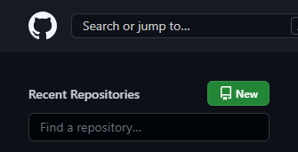
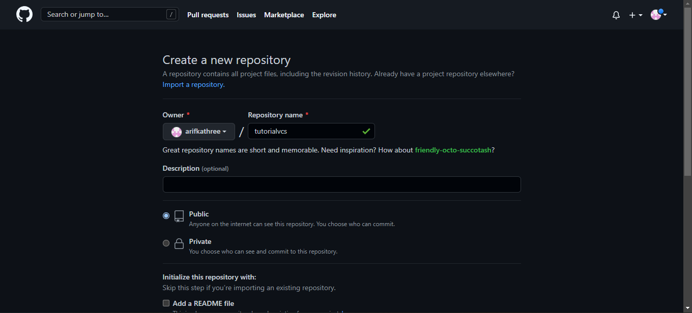

  

  

# 🖥 Latihan VCS Step By Step 

  

> ## Download Git Bash
> Sebelum kalian memulai Tutorialnya, kalian wajib **Download** Programnya terlebih dahulu.
>- [Git Bash](https://git-scm.com/downloads)

## 🤖 Konfigurasi Nama Device dan E-mail
Hal ini perlu kalian lakukan agar tidak terjadi error saat kalian melakukan perintah ***git commit***.
> ***$ git config --global user.name "UsernameAnda"***
> 
> ***$ git config --global user.email "email anda"***

## 🌐Buat Akun di **Github**
Buat Akun atau ***Sign In*** [GitHub](https://github.com)

## 📔Buat Repository Baru
Setelah berhasil membuat akun baru dan sudah Login ke [GitHub](https://github.com) Anda bisa membuat Repository dengan mengklik Button ***'New'*** pada tampilan awal [GitHub](https://github.com) Anda.

Kemudian Kalian akan diarahkan pada halaman untuk membuat Repository baru.

## :floppy_disk: Buat Folder Baru
Lalu kalian buat folder di Local Disk komputer kalian.

