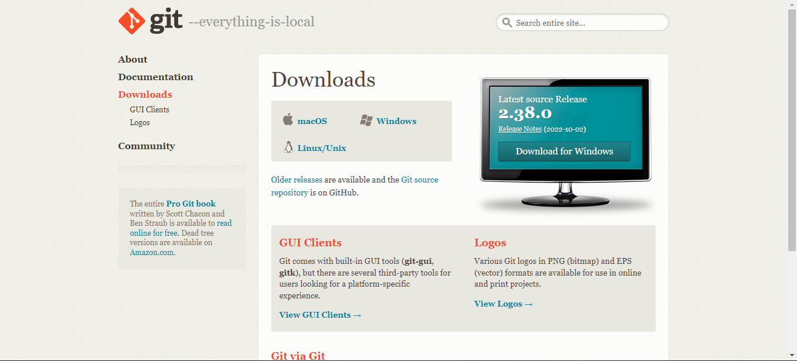
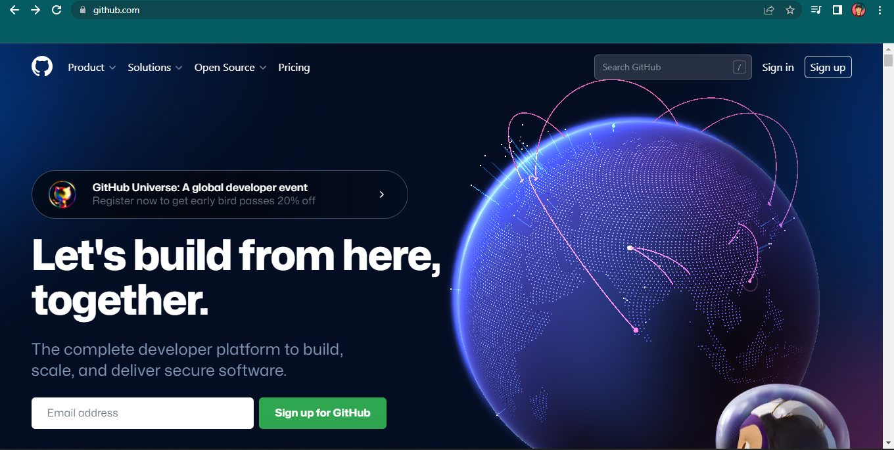

  

  

# 🖥 Latihan VCS Step By Step

> ## Download Git Bash
> Sebelum kalian memulai Tutorialnya, kalian wajib **Download** Programnya terlebih dahulu
>- [Git Bash](https://git-scm.com/downloads)

## 🤖 Konfigurasi Nama Device dan E-mail
Hal ini perlu kalian lakukan agar tidak terjadi error saat kalian melakukan perintah ***git commit***
> ***$ git config --global user.name "UsernameAnda"***
> 
> ***$ git config --global user.email "email anda"***

