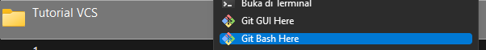

  

  

# 🖥 Latihan VCS Step By Step 

  

> ## Download Git Bash
> Sebelum kalian memulai Tutorialnya, kalian wajib **Download** Programnya terlebih dahulu.
>- [Git Bash](https://git-scm.com/downloads)

## 🤖 Konfigurasi Nama Device dan E-mail
Hal ini perlu kalian lakukan agar tidak terjadi error saat kalian melakukan perintah ***git commit***.
> ***$ git config --global user.name "UsernameAnda"***
> 
> ***$ git config --global user.email "email anda"***

## 🌐Buat Akun di **Github**
Buat Akun atau ***Sign In*** [GitHub](https://github.com)

## 📔Buat Repository Baru
Setelah berhasil membuat akun baru dan sudah Login ke [GitHub](https://github.com) Anda bisa membuat Repository dengan mengklik Button ***'New'*** pada tampilan awal [GitHub](https://github.com) Anda.

Kemudian Kalian akan diarahkan pada halaman untuk membuat Repository baru.

## :floppy_disk: Buat Folder Baru
Lalu kalian buat folder di Local Disk komputer kalian.

> ## :warning: SEDUH KOPI DAN BELI ROKOK :warning:
> Sebelum lanjut, disarankan untuk membuat kopi dan rokok dulu. Karena tahap dibawah memiliki beberapa efek samping, seperti:
> - Kepala Bergetar
> - Nyeri Dibagian Badan Belakang
> - Kedutan Bahkan Kejang 

Setelah kalian buat folder baru **Klik Kanan** pada **Folder** tersebut lalu klik **Git Bash Here** maka akan muncul Pop-up aplikasi Git Bash

Buat **Folder Baru** dan mengarahkan **Git Bash** pada directory file tersebut
>$mkdir latihan1
>
>$cd latihan1

Tambahkan Judul atau **Header** ke dalam file **README.md** yang nantinya akan dimasukkan ke dalam **Repository** yang telah kita buat
>$echo "#LatihanVCS" >> README.md

Kemudian buaat Repository lokal menggunakan perintah ***git init***
>$ git init

Masukkan file **README.md** yang beri judul tadi ke dalam **Repository** menggunakan perintah ***git add***
>$git add README.md

Setelah ditambahkan, kalian harus menyimpan dan mengkonfirmasi perubahan dengan komentar menggunakan perintah ***git commit -m "contoh commit"***
>$ git commit -m "Commit Pertama"

Setelah itu menambahkan remote repository. remote Repository merupakan repository server yang akan digunakan untuk menyimpan setiap perubahan pada local repository, sehingga dapat diakses oleh banyak user. dengan menggunakan perintah ***git remote add 'nama' 'url'***
>$git remote add origin https://github.com/arifkathree/tutorialvcs.git

Dan untuk mengirim perubahan pada local Repository ke server gunakan perintah ***git push -u 'nama' 'branch'***
>$git push -u origin master

Terakhir kita bisa cek di Repository pada Website [Github](https://github.com)

## Roadmap
- [x] Login / Sign Up
- [x] Buat Repository
- [x] Buat Folder dan Bash Here
- [x] Buat Folder dan Arahkan Directory
- [x] Buat Judul Pertama (echo "#Bla Bla Bla" >> README.md)
- [x] Inisialiasi .git (git init)
- [x] git add README.md
- [x] Keterangan Konfirmasi (git commit -m "sample commit")
- [x] Menghubungkan Repository (git remote add origin url)
- [x] Upload Perubahan (git push -u origin master)
  

